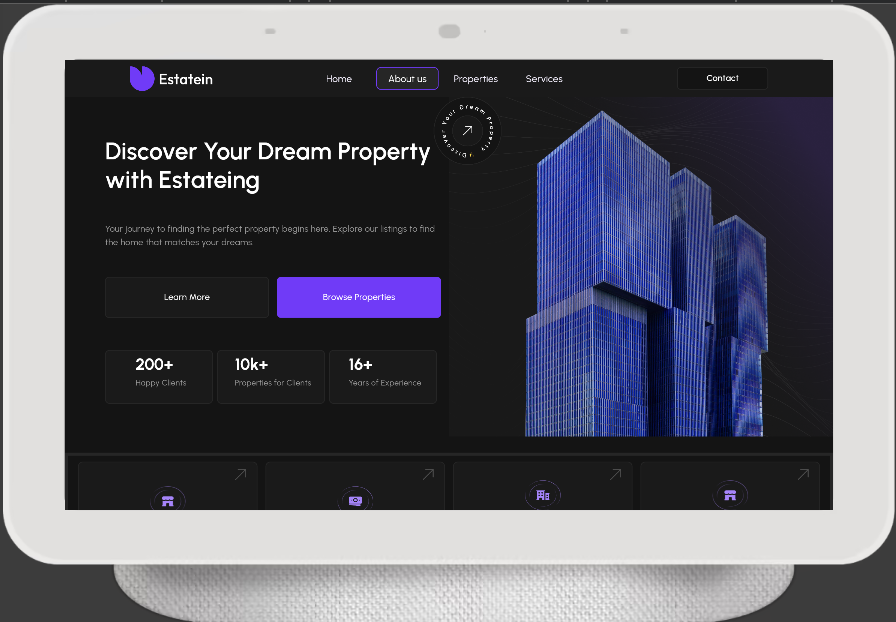

# 🏡 Estatein - Responsive Real Estate Website Template

Welcome to **Estatein**, a sleek and modern responsive real estate template built for showcasing dream properties with elegance and clarity. Whether you're a real estate agent, agency, or developer, this template is designed to help you connect clients with their ideal homes.

---
## Thumbnail


## 🚀 Features

- 💻 Fully responsive design — works beautifully on desktop, tablet, and mobile
- 🏷️ Clean, modern UI optimized for property showcasing
- 💼 Professional sections like: 
  - Hero with CTA
  - Services
  - Featured Properties
  - Stats/Experience
  - Contact Info
- 🌙 Dark-themed aesthetic with vibrant accent colors
- ⚡ Fast loading and SEO-friendly structure
- 🔄 Easy to customize and extend
- 🖼️ Elegant and Modern Design
- 🖼️ Pixel-Perfect Designs
- 💎 Interactive Property Search


---

## 📸 Screenshots

### 💻 Desktop View


### 🖥️ Tablet View


### 📱 Mobile View


---

## 🧩 Tech Stack

- Flutter
- Dart

---

## 🔧 Getting Started

1. Clone the repository:
   ```bash
   git clone https://github.com/JonathanGech/real-state.git

## 📂 Folder Structure
## Main Structure

- `lib/components`  
  Contains reusable UI components such as buttons, cards, and other elements used throughout the site.

- `lib/Pages`  
  Holds full page layouts like Home, About, Properties, Services, and Contact.

- `lib/widgets`  
  Contains major sections of the site. Each of the following has its own folder:
  - `navbar`
  - `body`
  - `links`
  - `feature`
  - `testimonials`
  - `questions`
  - `start`
  - `footer`

> Inside each widget folder, there's a `view` subfolder with three screen-specific layers:
  - `desktop`
  - `tablet`
  - `mobile`

This structure helps maintain clear separation between responsive layouts, making it easier to manage design for different devices.

- `lib/utils`  
  Includes utility files and shared helpers used across components and widgets.

---

> ✅ Designed for easy navigation, maintenance, and quick adaptation to new sections or styles.

## ✨ Credits
 - Special thanks to `Praha | Produce UI` : https://www.figma.com/design/Tr9wzFtZRz8AZ322xeDX4P/Real-Estate-Business-Website-UI-Template---Dark-Theme-%7C-Produce-UI--Community-?t=RdewZe8rCpPtZqbE-0
 

 - 

## 📬 Contact

Feel free to reach out with suggestions, ideas, or to show how you’ve customized it!

Let's make dream homes more discoverable. 
Email: jonathangetachew2014@gmail.com

## Licence
This project is licensed under the `Apache-2.0 license`.
